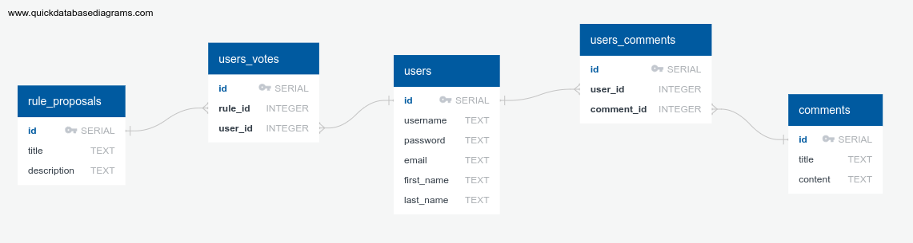

1. **What goal will your website be designed to achieve?**
   * My website will serve as a history of personal fantasy football league. The site will also allow league members to communicate, vote on rules, and declare keepers.
2. **What kind of users will visit your site? In other words, what is the demographic of your users?**
   * The users will be the members of our fantasy fooball league.
3. **What data do you plan on using? You may have not picked your actual API yet, which is fine, just outline what kind of data you would like it to contain.**
   * https://docs.sleeper.app/
   * Contains data about each member of league, each league members roster, and each roster's players
4. **In brief, outline your approach to creating your project (knowing that you may not know everything in advance and that these details might change later). Answer questions like the ones below, but feel free to add more information:**
    * *What does your database schema look like?*
      * 
    * *What kinds of issues might you run into with your API?*
       * Risk of being IP-blocked if making over 1000 API cllas per minute
       * Mapping player IDs to the "fetch all players" call and saving that information to my server and how to update this info as player information changes (only one call per day allowed)
    * *Is there any sensitive information you need to secure?*
      * No API Token is necessary, as you cannot modify contents via this API
    * *What functionality will your app include?*
        * Display all rosters of all league members
        * Display league standings and playoff bracket results from past season
        * Display past years draft board
        * Allow users to comment on draftboard, rosters, ect.
        * Allow users to make blog posts
        * Allow users to vote on league rules
        * Allow users to declare keepers
    * *What will the user flow look like?*
      * User will register/login and be redirected to user home page. User homepage displays user info, user roster, ect. Navbar will contain links to draftboard results, league rules, show all rosters, playoff results, and voting portal. If logged in, users will be able to vote yes or no on rule proposals that only logged in users can create.
    * *What features make your site more than CRUD? Do you have any stretch goals?*
      * Allow users to propose new rules and submit votes on those rules
      * Create custom power rankings using statistical analysis